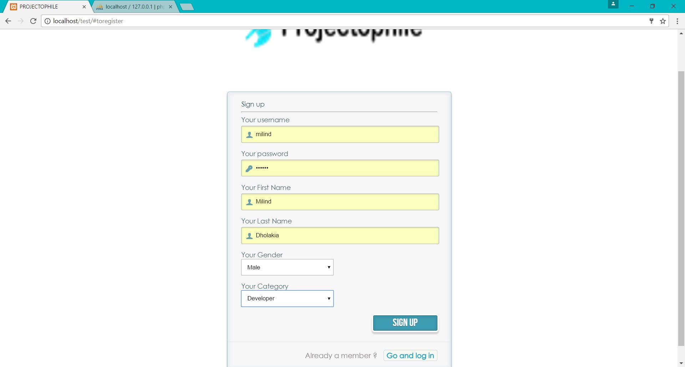
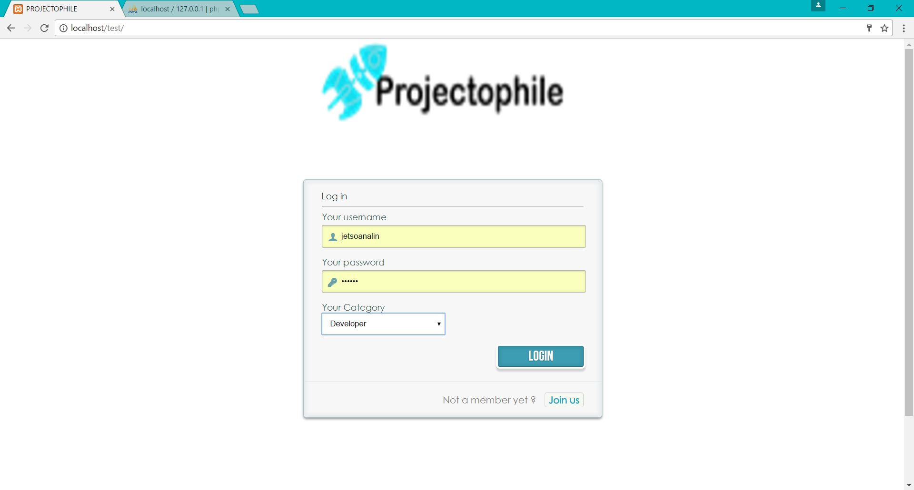
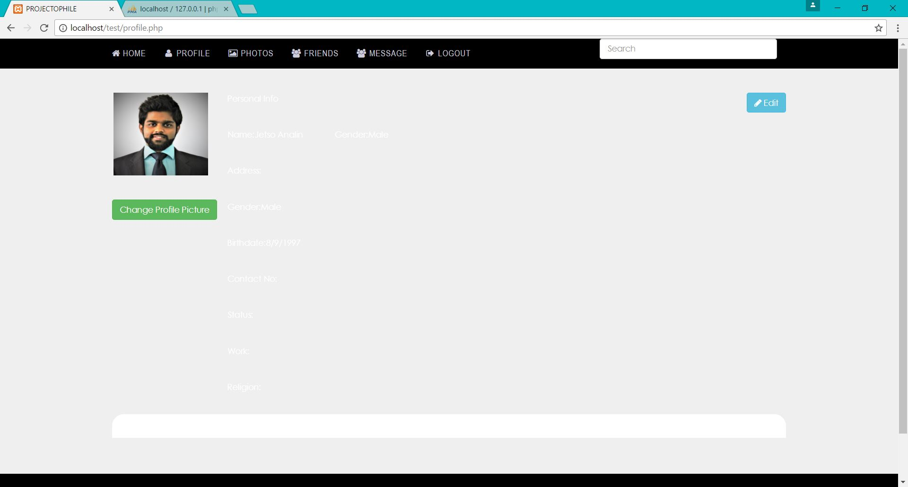
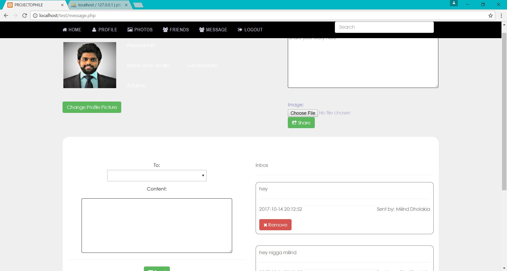

# projectophile_platform
Many good initiatives by students in the form of project is presently going   un-noticed because of lack of awareness. If a common knowledge platform  is created to bring all project works taken up at various levels by the students in Technical  / Higher Educational Institutes and Universities throughout the country , then it will be a great source of knowledge and also will help the student community to take up unique/innovative project works.

## SCREENSHOTS

